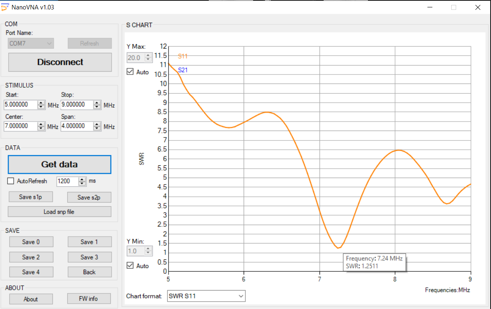
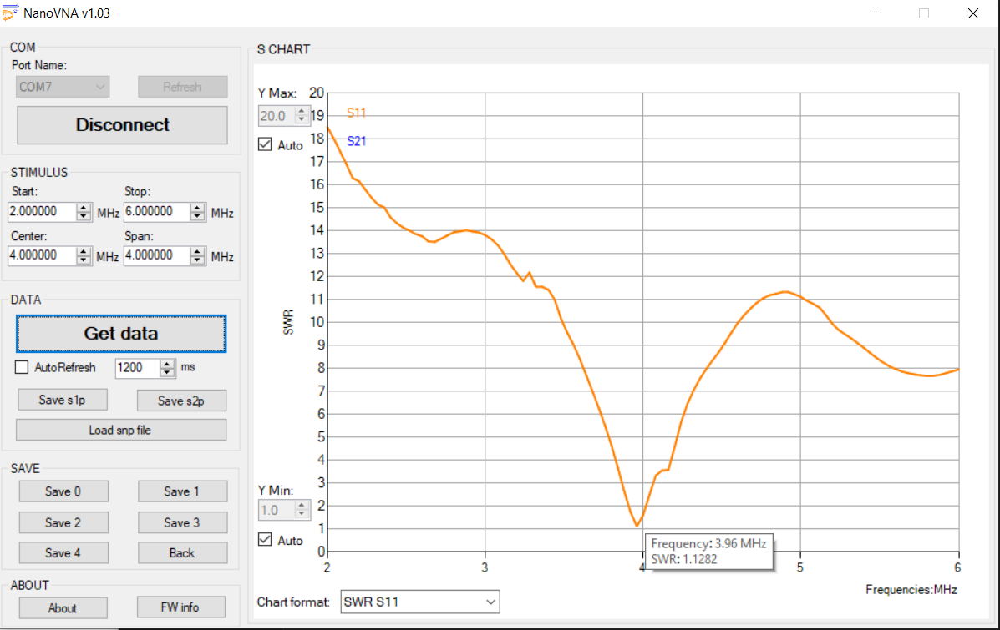
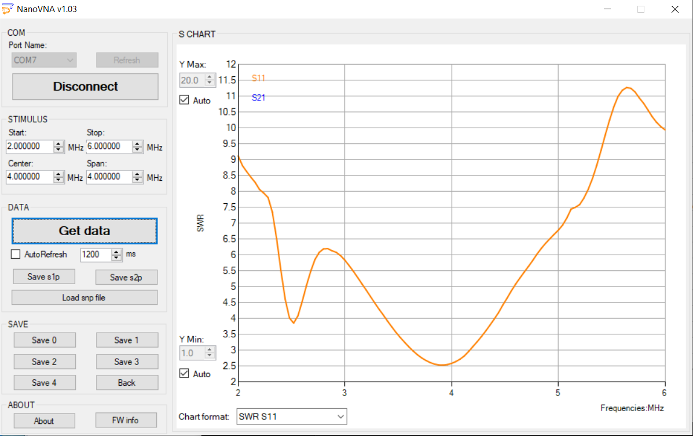
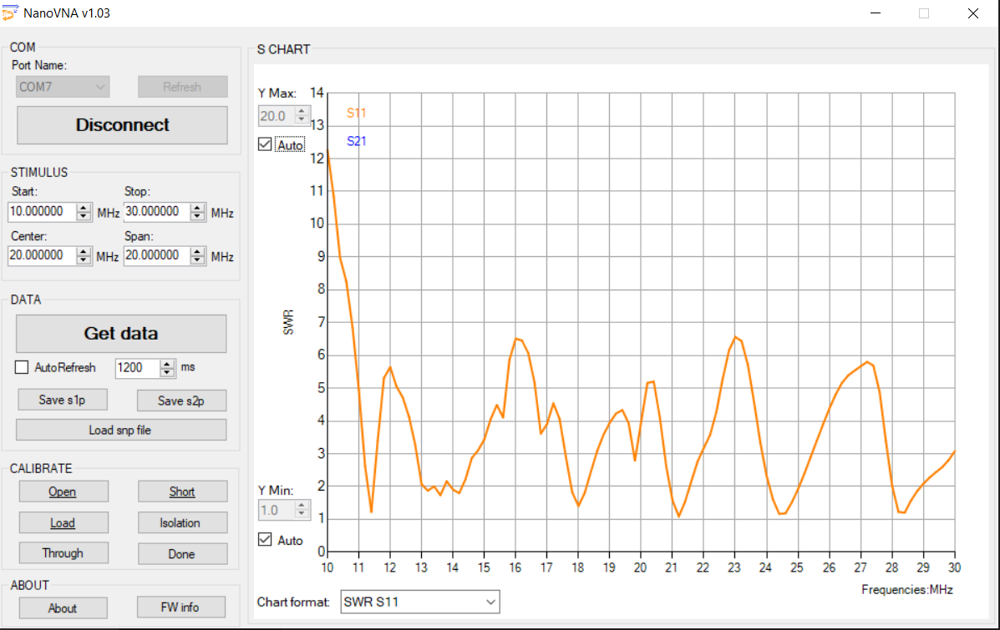
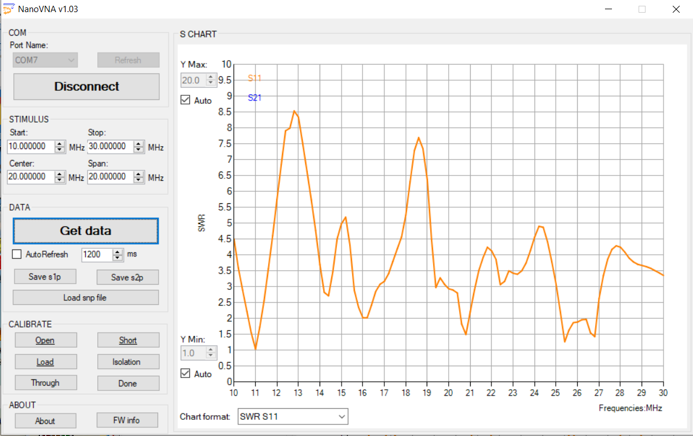

```{r setup, include=FALSE}
knitr::opts_chunk$set(echo = FALSE, out.width = "900px", out.height = "600px")
```

## Background

Rod Kreuter WA3ENK and Mike Coslo N3LI conducted separate measurements of the club's antennas in late August 2019.

This document shows the results of their measurements.

## 40m dipole @ 60'

### Broad sweep

#### WA3ENK

```{r}
knitr::include_graphics("img/2019-08-27-wa3enk/Club40_60_1.pdf")
```

#### N3LI 

```{r}

```

### 40m band (WA3ENK)

```{r}
knitr::include_graphics("img/2019-08-27-wa3enk/Club40_60_2.pdf")
```

### 30m band

```{r}
knitr::include_graphics("img/2019-08-27-wa3enk/Club40_60_3.pdf")
```

## 40m dipole @ 80'

### Broad sweep

#### WA3ENK

```{r}
knitr::include_graphics("img/2019-08-27-wa3enk/Club40_80_1.pdf")
```

#### N3LI

```{r}
knitr::include_graphics("img/2019-08-26-n3li/40 meter 80 feet.png")
```

### 40m band (WA3ENK)

```{r}
knitr::include_graphics("img/2019-08-27-wa3enk/Club40_80_2.pdf")
```

### 15m band (WA3ENK)

```{r}
knitr::include_graphics("img/2019-08-27-wa3enk/Club40_80_3.pdf")
```

## 80m dipole CW cut

### N3LI

```{r}

```

### WA3ENK

```{r}
knitr::include_graphics("img/2019-08-27-wa3enk/Club80_cw_1.pdf")
```

```{r}
knitr::include_graphics("img/2019-08-27-wa3enk/Club80_cw_2.pdf")
```

```{r}
knitr::include_graphics("img/2019-08-27-wa3enk/Club80_cw_3.pdf")
```

```{r}
knitr::include_graphics("img/2019-08-27-wa3enk/Club80_cw_4.pdf")
```

```{r}
knitr::include_graphics("img/2019-08-27-wa3enk/Club80_cw_5.pdf")
```

## 80m dipole phone cut

This antenna was damaged in late August 2019 and has not been repaired yet.

### N3LI

```{r}

```

### WA3ENK

```{r}
knitr::include_graphics("img/2019-08-27-wa3enk/Club80_Phone_1.pdf")
```

```{r}
knitr::include_graphics("img/2019-08-27-wa3enk/Club80_Phone_2.pdf")
```

## 160m dipole

This antenna is not in operation.

```{r}
knitr::include_graphics("img/2019-08-27-wa3enk/Club_160_1.pdf")
```

## Tribander @ 60'

### N3LI

```{r}

```

### WA3ENK

```{r}
knitr::include_graphics("img/2019-08-27-wa3enk/Club_Tri_60_1.pdf")
```

```{r}
knitr::include_graphics("img/2019-08-27-wa3enk/Club_Tri_60_2.pdf")
```

```{r}
knitr::include_graphics("img/2019-08-27-wa3enk/Club_Tri_60_3.pdf")
```

```{r}
knitr::include_graphics("img/2019-08-27-wa3enk/Club_Tri_60_4.pdf")
```

```{r}
knitr::include_graphics("img/2019-08-27-wa3enk/Club_Tri_60_5.pdf")
```

```{r}
knitr::include_graphics("img/2019-08-27-wa3enk/Club_Tri_60_6.pdf")
```

## Tribander @ 80'

### N3LI

```{r}

```

### WA3ENK

```{r}
knitr::include_graphics("img/2019-08-27-wa3enk/Club_Tri_80_1.pdf")
```

```{r}
knitr::include_graphics("img/2019-08-27-wa3enk/Club_Tri_80_2.pdf")
```

```{r}
knitr::include_graphics("img/2019-08-27-wa3enk/Club_Tri_80_3.pdf")
```

```{r}
knitr::include_graphics("img/2019-08-27-wa3enk/Club_Tri_80_4.pdf")
```

## VHF (WA3ENK)


```{r}
knitr::include_graphics("img/2019-08-27-wa3enk/Club_VHF_1.pdf")
```

```{r}
knitr::include_graphics("img/2019-08-27-wa3enk/Club_VHF_2.pdf")
```

